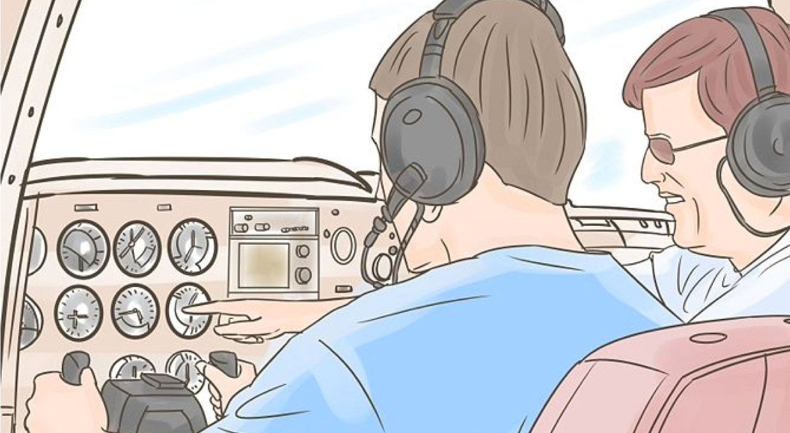

# Advanced Apache Kafka Streaming

Elephant Scale

---

## Agenda

 Module  Topic
---------------
 1  Modern Event-Driven Architecture with Kafka
 2  Kafka Internals & Cluster Architecture
 3  Kafka Operations & Observability
 4  Connectors, Pipelines & Integrations
 5  Reliability, Scaling & Performance
 6  Modern Kafka & Streaming Trends
 7  High-Volume Fan-Out Best Practices

Notes:

---
## Pre-requisites and Expectations

 * Strong understanding of Kafka fundamentals (topics, producers, consumers)

 * Experience with Linux command line and Docker/Kubernetes

 * Familiarity with streaming use cases

     - IoT, analytics, observability, data integration

 * Curiosity!

   - Ask a lot of questions

Notes

---
## Our Teaching Philosophy

 * Emphasis on concepts & fundamentals

 * Highly interactive (questions and discussions are welcome)

 * Hands-on (learn by doing)

 * Real production patterns — not toy examples

Notes

---

## Lots of Labs: Learn By Doing

Notes

---

## Analogy: Learning To Fly...

---

## Introductions

Notes

---

## + Flight Time

---

## This Will Take A Lot Of Practice

---
## About You And Me

* About Instructor
* About you
    - Your Name
    - Your background (data engineer, architect, DevOps, SRE, ...)
    - Technologies you are familiar with
    - Kafka experience (scale of 1 - 4 ;  1 - new,   4 - expert)
    - Something non-technical about you! (favorite ice cream flavor / hobby...)

 &nbsp;
 &nbsp;
 &nbsp;

---

