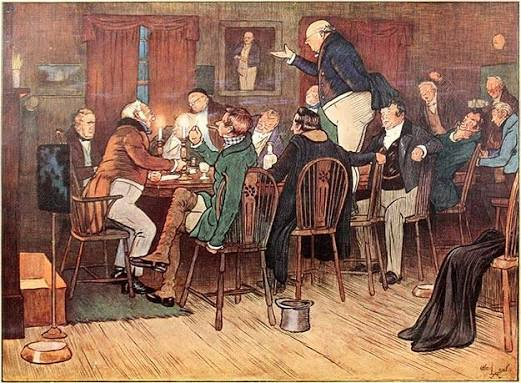
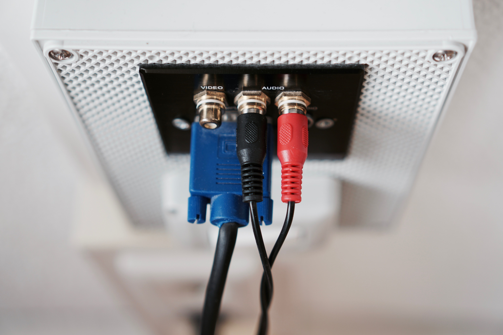
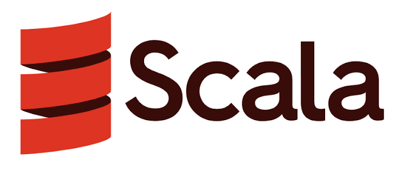
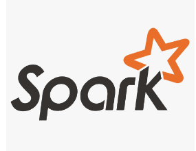

# Module 1 — Modern Event-Driven Architecture with Kafka

Elephant Scale

---

## Module 1 Agenda

- Why Kafka is the backbone of real-time systems
- Modern event-driven technology stack
- Data flow walkthrough
- Event streams vs queue semantics
- Integration with external systems
- Enterprise streaming evolution

---

## Where Kafka Came From

- Built at **LinkedIn** around **2010** to untangle a mess of point-to-point data pipelines — every system wired to every other. They needed **one** high-throughput pipeline for activity and operational data.
- Created by **Jay Kreps, Neha Narkhede, and Jun Rao**; open-sourced in **2011**, a top-level **Apache** project by **2012**.
- **The name:** Kreps named it after the writer **Franz Kafka** — a system "optimized for writing" deserved an author's name (and he'd taken plenty of lit classes).
- The three creators left LinkedIn in **2014** to found **Confluent**, now the main commercial steward of Kafka.
- Full circle: LinkedIn today runs Kafka at **~7 trillion messages/day** (see the scale slide).


---

## What Is Event-Driven Architecture?

An **event** is an immutable record that *something happened* — a fact, stated in
the past tense: `OrderPlaced`, `PaymentFailed`, `SensorRead = 72°F`.

**Event-Driven Architecture (EDA):** services **produce and react to events**
through a shared log, instead of calling each other directly.

- **Request/response** — a service calls another and waits for the reply; tightly coupled
- **Event-driven** — a producer emits an event; any number of consumers react on their own, asynchronously and independently

```
Producer ──"OrderPlaced"──▶ [ Kafka log ] ──┬──▶ Inventory
                                            ├──▶ Shipping
                                            └──▶ Analytics
```

Why it matters: **decoupling** (services evolve independently), **scalability**
(add consumers freely), **resilience** (a down consumer blocks no one), and
**replay** (the log is a durable record of what happened).

> Kafka is the durable log in the middle — the backbone that makes EDA practical at scale.

---

## Why Real-Time Matters

Modern enterprises need to act on data **as it happens**, not hours later.

Use cases that demand real-time streaming:
- Fraud detection (milliseconds to block a transaction)
- IoT sensor telemetry (millions of devices)
- Observability pipelines (logs, metrics, traces)
- Personalization engines (act while the user is still on the page)
- Supply chain event tracking

> Streaming complements batch rather than replacing it — and the boundary is blurring (lakehouse, Iceberg, stream/batch convergence).


---

## What Is Apache Kafka?

Kafka is a **distributed event streaming platform**.

Core capabilities:
- **Publish and subscribe** to streams of events
- **Store** events durably and reliably — including **Tiered Storage** (KIP-405, GA in Kafka 4), which offloads older segments to object storage for low-cost long-term retention
- **Process** events as they occur

Key design goals:
- High throughput (millions of events/sec)
- Low latency (milliseconds)
- Fault tolerance (replication)
- Horizontal scalability

> **Kafka 4 is KRaft-only** — ZooKeeper has been fully removed. Cluster metadata now lives in an internal Kafka log managed by a built-in controller quorum.

---

## Kafka in the Enterprise Landscape

```
Microservices    IoT Devices    Databases    External APIs
      │               │              │              │
      └───────────────┴──────────────┴──────────────┘
                              │
                    ┌─────────▼─────────┐
                    │   Apache Kafka    │
                    │  (Event Backbone) │
                    └─────────┬─────────┘
                              │
      ┌───────────────┬────────┴────────┬───────────────┐
      │               │                 │               │
  Analytics      Data Lake          Microservices    AI/ML
  (Spark/Flink)  (S3/HDFS)          (Consumers)    Pipelines
```

Kafka is the **central nervous system** of the modern data platform.

---

## The Modern Event-Driven Technology Stack

- **Kafka Core** — Durable event log, topic management, replication
- **Kafka Connect** — Data integration: source and sink connectors
- **Kafka Streams** — Stream processing library (JVM)
- **ksqlDB** — SQL interface for stream processing
- **Schema Registry** — Schema management (Avro, Protobuf, JSON Schema)
- **Monitoring Layer** — Prometheus, Grafana, Kafka UI, Cruise Control
- **Security Layer** — TLS, SASL, ACLs, RBAC


---

## A Short History of Kafka Streams

- **Before 2016** — processing Kafka data meant hand-rolled consumer/producer loops or bolting on separate clusters (Storm, Samza, Spark Streaming). Stateful joins and windows were DIY and painful.
- **2016 (Kafka 0.10)** — **Kafka Streams** arrives: a **client library, not a cluster**. Stateful processing — joins, aggregations, windowing — runs *inside your app*, made fault-tolerant by changelog topics.
- **2017 (Kafka 0.11)** — **exactly-once** processing semantics land, making Streams safe for money-movement pipelines.
- **2017 → ksqlDB** — Confluent adds **KSQL / ksqlDB**, a SQL layer built *on top of* Kafka Streams.
- **2023 → today** — momentum shifts to **Apache Flink** (Confluent acquired Immerok, 2023); **Flink SQL** is now the favored engine and ksqlDB is de-emphasized. Kafka Streams remains the go-to for **in-app JVM** processing.

> The defining idea: Kafka Streams is a **library, not a platform** — no separate processing cluster to operate. That "just add a dependency" model is why it spread.

---

## Kafka Core Concepts

**Topic** — a named, ordered, immutable log of events

**Partition** — a topic is split into partitions for parallelism

**Offset** — position of an event within a partition

**Producer** — writes events to topics

**Consumer** — reads events from topics

**Consumer Group** — a set of consumers that share the work of reading a topic

**Broker** — a Kafka server that stores and serves partitions

> Kafka 4 ships a new **server-side consumer rebalance protocol (KIP-848)** that replaces stop-the-world rebalances with incremental, broker-coordinated reassignment. (Mechanics in Module 5.)

---

## If Kafka Were Named Today

Kafka's vocabulary predates today's streaming and database conventions. If you come
from other systems, this mental translation helps:

- **Broker → Server** (or Node)
- **Producer → Publisher** (or Writer)
- **Consumer → Subscriber** (or Reader)
- **Partition → Shard** (a horizontal slice — the same idea as a database shard)
- **Topic → Stream** (or Channel)
- **Offset → Cursor** (your position in the log)
- **Consumer Group → Subscription** (or a worker pool sharing the load)

> The names are historical, not technical destiny — the *concepts* are what matter. When a term feels odd, translate it to the modern word in your head.

---

## Data Flow Walkthrough

```
Producers
  │  (write events)
  ▼
┌────────────────────────────┐
│  Kafka Cluster             │
│  ┌──────┐  ┌──────┐        │
│  │ B1   │  │ B2   │  ...   │
│  └──────┘  └──────┘        │
│   Topic partitions         │
└───────────┬────────────────┘
            │  (read events)
            ▼
Consumers / Consumer Groups
            │
            ▼
Analytics │ Data Lake │ Microservices │ AI Pipelines
```

---

## Event Streams vs Queue Semantics

- **Message deletion** — Queue: after consumption · Kafka: configurable retention
- **Multiple consumers** — Queue: competing consumers · Kafka: each group reads independently
- **Replay** — Queue: not possible · Kafka: yes, seek to any offset
- **Ordering** — Queue: per-queue · Kafka: per-partition
- **Durability** — Queue: varies · Kafka: configurable replication
- **Backpressure** — Queue: built-in · Kafka: consumer controls its own pace

**Native queues — Share Groups (KIP-932, Kafka 4):**
- Multiple consumers read from the **same partitions** cooperatively (no partition-to-consumer binding)
- **Per-message acknowledgement** and redelivery — true queue semantics, not just competing consumer groups
- Lets one platform serve both stream (replay, fan-out) and queue (work-distribution) workloads

> Early access in Kafka 4.0; enable explicitly. Hands-on in Lab 1.

---

## Topics, Partitions, and Offsets

```
Topic: orders
  Partition 0:  [0] [1] [2] [3] [4] ...
  Partition 1:  [0] [1] [2] [3] ...
  Partition 2:  [0] [1] [2] ...

Consumer Group A (reads all partitions):
  Consumer 1 → Partition 0 (at offset 4)
  Consumer 2 → Partition 1 (at offset 3)
  Consumer 3 → Partition 2 (at offset 2)
```

- Events within a partition are **strictly ordered**
- Events across partitions are **not globally ordered**
- Partition count = maximum consumer group parallelism



---

## Lab 1 — Cluster Topology & Topics

**Stop here and run the lab now.** You'll apply everything from the last few slides
on a live 3-broker KRaft cluster.

You will:
1. Connect to a running KRaft cluster and inspect broker/quorum metadata
2. Create topics with different partition counts and replication factors
3. Examine partition assignment and leader distribution
4. Configure and observe retention policies and log compaction
5. Visualize topics, partitions, and lag in **Kafka UI**
6. Contrast consumer groups with **Share Groups (KIP-932)** — native queue semantics

Environment: KRaft Kafka 4 cluster (Docker Compose) + Kafka UI · **60–75 minutes**

---

## Part 2 — The Kafka Ecosystem (after the lab)

Welcome back. You've built topics, watched leaders move, and seen consumer vs share
groups on a live cluster.

Now we zoom out from the core to the tools around it — **Connect, Streams, ksqlDB,
Schema Registry** — and the patterns that put Kafka at the center of a data platform.

> Quick debrief first: what surprised you in the lab — leaders rebalancing, compaction, share vs consumer groups?

---

## Kafka Connect Overview

Kafka Connect provides **pre-built, scalable data pipelines**.

```
Source Systems          Kafka Connect          Kafka Topics
─────────────          ─────────────          ────────────
PostgreSQL    ──────►  Source Connector  ──►  orders
MySQL         ──────►  Source Connector  ──►  users
S3 bucket     ──────►  Source Connector  ──►  files

Kafka Topics          Kafka Connect           Sink Systems
────────────          ─────────────          ─────────────
analytics   ──────►   Sink Connector   ──►  Elasticsearch
events      ──────►   Sink Connector   ──►  S3 / Data Lake
metrics     ──────►   Sink Connector   ──►  ClickHouse
```

700+ connectors available on Confluent Hub.


---

## Kafka Streams Overview

Kafka Streams is a **Java/Scala library** for stream processing.

Key features:
- No separate cluster required — runs inside your application
- Exactly-once processing semantics
- Stateful operations (joins, aggregations, windowing)
- Interactive queries (expose state to other services)
- Fault-tolerant state backed by changelog topics

```java
KStream<String, Order> orders = builder.stream("orders");
KTable<String, Long> orderCounts = orders
    .groupByKey()
    .count();
orderCounts.toStream().to("order-counts");
```


---

## A Short History of Scala

- **Scala** — a JVM language fusing **object-oriented and functional** programming, created by **Martin Odersky** (EPFL, Switzerland), first released **2004**.
- **Twitter put it on the map:** around **2009** Twitter moved core backend services off **Ruby on Rails** onto Scala to survive its own growth — the adoption that made Scala *the* hot JVM language for large-scale systems.
- That wave shaped this ecosystem: **Kafka** (LinkedIn) and **Apache Spark** were both originally written in **Scala**.
- Kafka has since moved much of its code — and all its newer clients and KRaft — to **Java**, but its roots are Scala.

> Why it's here: Kafka was born in the Scala era (~2009–2013). The language cooled off, but the systems it produced — Kafka, Spark — became foundational.

---

## ksqlDB Overview

ksqlDB is a **SQL engine for stream processing** built on Kafka Streams.

```sql
-- Create a stream from a topic
CREATE STREAM orders (
    order_id VARCHAR,
    customer_id VARCHAR,
    amount DOUBLE
) WITH (KAFKA_TOPIC='orders', VALUE_FORMAT='JSON');

-- Continuous query: high-value orders
CREATE TABLE high_value_orders AS
SELECT customer_id, SUM(amount) AS total
FROM orders
GROUP BY customer_id
HAVING SUM(amount) > 10000;
```

Queries run **continuously** — results update as new events arrive.

> **2026 direction:** Confluent has de-emphasized ksqlDB in favor of **Flink SQL**, which offers the same continuous-SQL model with a richer engine and broader ecosystem. Flink is provisioned in this course's lab environment.

---

## Schema Registry

Schema Registry manages and enforces event schemas.

```
Producer → [Serialize with Schema] → Kafka
                    │
              Schema Registry
              (stores schema,
               assigns schema ID)
                    │
Consumer → [Deserialize with Schema ID] → Application
```

Benefits:
- Schema evolution without breaking consumers
- Compatibility checks (BACKWARD, FORWARD, FULL)
- Centralized schema governance
- Foundation for **data contracts** — schema plus validation rules, metadata, and ownership agreed between producers and consumers (a key 2026 governance theme)

---

## Integration with External Systems

Kafka integrates with the full data ecosystem:

- **Apache Spark** — Spark Structured Streaming reads from Kafka
- **Apache Flink** — Native Kafka source/sink connectors
- **REST APIs** — Kafka REST Proxy for HTTP-based producers/consumers
- **AI/ML Pipelines** — Feature stores, model serving, inference logging
- **Cloud (AWS/GCP/Azure)** — MSK, Confluent Cloud, Event Hubs


---

## Streaming-First Application Design

Traditional design:
```
App → Database → Report (batch, hours later)
```

Streaming-first design:
```
App → Kafka → Real-time processor → Immediate action
          └──► Data lake (durable replay)
          └──► ML pipeline (continuous training)
          └──► Microservices (event-driven triggers)
```

Design principle: **events are the source of truth**, not the database.

---

## Enterprise Streaming Patterns

**Event Sourcing** — store all state changes as events, derive state by replaying

**CQRS** — separate read (query) and write (command) models via events

**Saga Pattern** — coordinate long-running distributed transactions via events

**CDC (Change Data Capture)** — stream database changes into Kafka

**Fan-out** — one event triggers multiple independent consumers

---

## Kafka at Scale — Real Numbers

Production deployments at scale:

- **LinkedIn** — 7 trillion messages/day
- **Uber** — 1 trillion messages/day
- **Netflix** — Trillions of events/day
- **Cloudflare** — Petabytes/day
- **Walmart** — Billions of events during peak

> Kafka is proven at the most extreme scales on the planet.

---

## Module 1 Summary

- Kafka is the distributed event streaming backbone for modern enterprises
- Core abstractions: topics, partitions, offsets, producers, consumers
- Event streams differ from queues in durability, replay, and multi-consumer support
- The full stack: Kafka Core + Connect + Streams + ksqlDB + Schema Registry
- Integrates with Spark, Flink, REST, AI/ML, and cloud-native systems
- Streaming-first design treats events as the source of truth

---

## What's Next

**Module 2 — Kafka Internals & Cluster Architecture**

We go deep inside the broker:
- Log segments, indexes, and compaction
- KRaft — ZooKeeper-free Kafka
- Producer and consumer internals
- Exactly-once semantics

---

