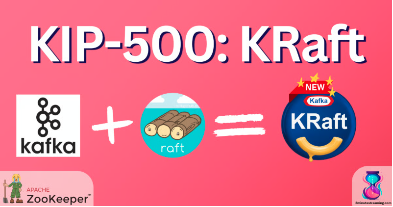

# Module 2 — Kafka Internals & Cluster Architecture

Elephant Scale

---

## Module 2 Agenda

- Broker internals: log segments, indexes, compaction
- KRaft — ZooKeeper-free Kafka architecture
- Controller quorum and metadata management
- Partition assignment and leader election
- In-Sync Replicas (ISR) and Eligible Leader Replicas (KIP-966)
- Producer internals
- Consumer internals and the KIP-848 rebalance protocol
- Exactly-once semantics and transactions

---

## The Kafka Broker

A Kafka broker is a JVM process that:
- Manages **log segments** on disk (one per partition)
- Handles **producer** write requests
- Handles **consumer** fetch requests
- Participates in **replication** with other brokers
- Maintains **partition leadership**

Each broker can handle hundreds of thousands of partitions and millions of messages per second.

---

## Log Segments — How Kafka Stores Data

Each partition is stored as a **sequence of segment files** on disk:

```
/kafka-logs/orders-0/
  ├── 00000000000000000000.log      ← events (binary)
  ├── 00000000000000000000.index    ← offset → file position
  ├── 00000000000000000000.timeindex ← timestamp → offset
  ├── 00000000000000012345.log      ← new segment after rollover
  └── 00000000000000012345.index
```

Key properties:
- Log is **append-only** — writes are sequential (fast)
- Segments are **immutable** once closed
- Older segments are deleted or compacted based on retention policy


---

## Log Indexes

Kafka maintains two indexes per segment for fast lookups:

**Offset index** — maps logical offset to byte position in the `.log` file
```
Offset 100 → byte 4096
Offset 200 → byte 8192
```

**Time index** — maps timestamp to offset
```
1716000000000 → offset 100
1716000060000 → offset 200
```

These enable O(log n) seeks without scanning the full log.

---

## What O(log n) Means — a Big-O Aside

Big-O describes **how work grows as the data grows** (n = number of records). It's
the *shape* of the cost, not an exact time.

- **O(1) — constant:** same cost at any size. *Appending* to the log; a hash lookup.
- **O(log n) — logarithmic:** grows very slowly — **double the data, add one step**. Binary search over Kafka's *sorted offset index*.
- **O(n) — linear:** grows in step with the data. *Scanning* a whole segment.
- **O(n²) — quadratic:** blows up fast; avoid on big data (nested loops).

To find one offset in a **1-billion-record** partition:
- **No index → O(n):** up to ~1,000,000,000 steps (a scan).
- **Sorted index → O(log n):** ~30 steps.

> That's the whole point of the `.index` file: turn a linear scan into a logarithmic seek, while appends stay O(1). This is why Kafka stays fast at massive scale.

---

## Log Compaction

For **state-based topics** (e.g., user profiles, configuration), Kafka supports compaction instead of deletion.

```
Before compaction (key → value):
  user-1 → {"name":"Alice"}
  user-2 → {"name":"Bob"}
  user-1 → {"name":"Alice Smith"}   ← latest for user-1
  user-2 → null                      ← tombstone (delete marker)

After compaction:
  user-1 → {"name":"Alice Smith"}   ← only latest kept
  (user-2 deleted)
```

Compacted topics guarantee **at least the last value per key** is retained forever.

---

## ZooKeeper → KRaft

**Legacy (ZooKeeper mode — historical context only):**
```
ZooKeeper Ensemble (3–5 nodes)
    │  (stores cluster metadata)
    ▼
Kafka Brokers  ←→  Controller Broker
                   (elected via ZK)
```

**KRaft mode — the only mode in Kafka 4:**
```
Kafka Brokers + KRaft Controllers
    │  (metadata stored in a Raft log inside Kafka itself)
    ▼
No external dependency!
```

> **ZooKeeper was fully removed in Apache Kafka 4.0.** Every Kafka 4 cluster runs KRaft. ZooKeeper is shown here only so you recognize it in older deployments and migration projects.


---

## KRaft Architecture

In KRaft mode, Kafka manages its own metadata:

```
┌─────────────────────────────────────┐
│         KRaft Controller Quorum     │
│   Controller 1 (Active Leader)      │
│   Controller 2 (Follower)           │
│   Controller 3 (Follower)           │
│                                     │
│   Metadata stored in __cluster_metadata topic │
└─────────────────────────────────────┘
            │  (metadata fetch)
            ▼
     Kafka Brokers (data plane)
```

Benefits: faster failover, simpler operations, no ZooKeeper to manage.

---
## Kraft


---


## Partition Assignment and Leader Election

When a topic is created, Kafka assigns partitions to brokers:

```
Topic: orders  (3 partitions, replication factor 3)

Partition 0: Leader=Broker1, Replicas=[1,2,3], ISR=[1,2,3]
Partition 1: Leader=Broker2, Replicas=[2,3,1], ISR=[2,3,1]
Partition 2: Leader=Broker3, Replicas=[3,1,2], ISR=[3,1,2]
```

- Partition **leader** handles all reads and writes
- Followers replicate from the leader
- If the leader fails, a new leader is elected from the ISR

---

## In-Sync Replicas (ISR)

The ISR is the set of replicas that are **fully caught up** with the leader.

```
Leader (Broker 1):  offset 1000
Follower (Broker 2): offset 1000  ← in ISR
Follower (Broker 3): offset 998   ← may be removed from ISR
```

Key configs:
- `replica.lag.time.max.ms` — max time a follower can be behind before removed from ISR
- `min.insync.replicas` — minimum ISR size required to accept writes (e.g., 2)
- `acks=all` — producer waits for all ISR members to acknowledge

**New in Kafka 4 — Eligible Leader Replicas (KIP-966, preview):**
- The controller now also tracks replicas that left the ISR but are *known to hold data up to the high watermark* — the **ELR**
- On a clean election with an empty ISR, a replica from the ELR can be elected **without data loss** — fixing the old "last replica standing" unclean-election dilemma
- Separates the *replication* quorum (ISR, known to the leader) from the *election* quorum (ISR + ELR, known to the controller)
- Enabled by default on new Kafka 4 clusters

---

## Lab 2 · Part 1 — Storage & Cluster Internals

**Stop here and run Part 1 now — Exercises 1, 2, 5, 6.** You'll see the storage and
cluster mechanisms from these slides as real bytes and live state.

1. Dump raw **log segment** files on disk — `.log` / `.index` / `.timeindex` *(Ex 1)*
2. Read the **`__consumer_offsets`** topic — where consumer positions live *(Ex 2)*
3. Watch the **ISR shrink** on broker failure, and see **ELR** (KIP-966) *(Ex 5)*
4. Examine the **KRaft metadata log** *(Ex 6)*

*Exercises 3–4 (transactions & idempotence) come after the next few slides — Part 2.*

Environment: same 3-broker KRaft cluster from Lab 1 · ~40 minutes

---

## Welcome Back — The Write Path & Exactly-Once

You've inspected the storage and cluster layer as real bytes: log segments,
`__consumer_offsets`, ISR/ELR, the KRaft log.

Now the **producer write path** — batching, delivery, idempotence — and how transactions
give **exactly-once**. You'll finish the lab (**Part 2, Exercises 3–4**) right after these.

---

## Producer Internals

The Kafka producer is a sophisticated client:

```
Application
    │
    ▼
[Serializer]
    │
    ▼
[Partitioner]  ← key-based or round-robin
    │
    ▼
[Record Accumulator]  ← batches records per partition
    │  (when batch.size or linger.ms reached)
    ▼
[Sender Thread]  ← sends batch to broker
    │
    ▼
[Broker]  → acks back to producer
```


---

## Producer Configuration — Key Parameters

- **`acks`** — Durability guarantee (0, 1, all). Default: 1
- **`batch.size`** — Max bytes per batch. Default: 16384 (16 KB)
- **`linger.ms`** — Wait time to fill a batch. Default: 0 (no wait)
- **`compression.type`** — none, gzip, snappy, lz4, zstd. Default: none
- **`max.in.flight.requests.per.connection`** — Concurrent unacknowledged requests. Default: 5
- **`retries`** — Retry count on failure. Default: MAX_INT
- **`enable.idempotence`** — Exactly-once producer semantics. Default: true (Kafka 3.0+)

---

## Idempotent Producer

With `enable.idempotence=true`:

```
Producer assigns:
  Producer ID (PID) = 42
  Sequence Number = 0

Broker deduplicates:
  Receives (PID=42, Seq=0) → accept, write
  Receives (PID=42, Seq=0) → DUPLICATE, discard
  Receives (PID=42, Seq=1) → accept, write
```

Prevents duplicate writes on retry — essential for exactly-once.

---

## A Word About "Idempotent"

It sounds like a medical diagnosis. It's actually the simplest idea in the room:

**Doing it again changes nothing.**

- Press the **elevator button** five times — the elevator does not arrive 5× faster. Same result. That's idempotent.
- A **light switch already set to "on"** — flip it to "on" again… still on.
- `abs(abs(x)) == abs(x)`. Multiplying by 1 all day.

For Kafka: when a producer retries and sends the same record twice, an **idempotent** producer makes the broker shrug and keep **one** copy — the retry changed nothing.

> Say "idempotent" in a meeting and everyone assumes you're the smartest person there. Now you actually are.

---

## Consumer Internals

The Kafka consumer manages its own position (offset):

```
Consumer
    │
    ├── Poll loop: consumer.poll(Duration)
    │       │
    │       └── Fetches records for assigned partitions
    │
    ├── Process records
    │
    └── Commit offsets (auto or manual)
            │
            └── Stored in __consumer_offsets topic
```

Key difference from traditional queues: **the consumer controls its own pace**.

---

## Consumer Group Coordination

```
Topic: orders  (4 partitions)

Consumer Group "payment-service" (3 consumers):
  Consumer A → Partition 0, Partition 1
  Consumer B → Partition 2
  Consumer C → Partition 3

Consumer joins or leaves → GROUP REBALANCE
  All partition assignments are recalculated
```

Rebalance types:
- **Eager** (stop-the-world) — all consumers stop, reassign
- **Cooperative** (incremental, client-side) — only affected partitions move
- **New consumer protocol (KIP-848, GA in Kafka 4)** — the *broker* coordinates the assignment instead of a client-side leader. Rebalances become incremental and far less disruptive; opt in per group via `group.protocol=consumer`

---

## Offset Management

Offsets are committed to the `__consumer_offsets` internal topic:

```
At-most-once:    commit before processing  (may lose data)
At-least-once:   commit after processing   (may duplicate)
Exactly-once:    transactional commit      (Kafka transactions)
```

Key configs:
- `enable.auto.commit=true` — auto-commit every `auto.commit.interval.ms`
- `enable.auto.commit=false` — manual `commitSync()` or `commitAsync()`

> In production: always use manual commit with exactly-once or at-least-once + idempotent consumers.

---

## Exactly-Once Semantics (EOS)

Kafka supports end-to-end exactly-once for Kafka-to-Kafka pipelines:

```
Producer (transactional)
    │  beginTransaction()
    │  send(record1)
    │  send(record2)
    │  commitTransaction()  ← atomic: both records visible or neither
    ▼
Kafka Topic
    │
Consumer (isolation.level=read_committed)
    │  ← only sees committed transactions
    ▼
Application
```

Config: `transactional.id=unique-producer-id`, `isolation.level=read_committed`

> **Kafka 4 hardening (KIP-890):** the transaction protocol was reworked to close long-standing correctness gaps (notably "hanging transactions"), adding per-transaction epoch verification between client and broker. Existing transactional code keeps working — it just gets stronger guarantees.


---

## The `__consumer_offsets` Topic

Internal topic that stores all committed consumer offsets:

```bash
# Inspect offset commits
# Kafka 4 moved these internal formatters to the org.apache.kafka.tools.consumer
# package; the old kafka.coordinator.* Scala formatters were removed.
kafka-console-consumer.sh \
  --bootstrap-server localhost:9092 \
  --topic __consumer_offsets \
  --formatter org.apache.kafka.tools.consumer.OffsetsMessageFormatter \
  --from-beginning
```

Output format:
```
[payment-service,orders,0]::OffsetAndMetadata(offset=1234, ...)
[payment-service,orders,1]::OffsetAndMetadata(offset=5678, ...)
```

---

## The `__transaction_state` Topic

Internal topic that tracks transactional producer state:

```
Producer ID (PID): 42
Transaction state: IN_PROGRESS → PREPARE_COMMIT → COMPLETE_COMMIT

Partitions involved:
  orders-0, orders-1
```

Used by the broker to:
- Deduplicate writes from idempotent producers
- Ensure atomicity of transactions
- Handle crash recovery

---

## Lab 2 · Part 2 — Producer & Transaction Internals

**Now finish the lab — Exercises 3, 4.** Apply the write-path slides you just saw.

1. Run a **transactional producer**; consume with `read_committed` vs `read_uncommitted` *(Ex 3)*
2. Trace the commit through **`__transaction_state`** *(Ex 3.3)*
3. Verify **idempotent dedup** — read `producerId` + `baseSequence` off disk *(Ex 4)*

Environment: same cluster · ~25 minutes

---

## Module 2 Summary

- Kafka stores data as append-only log segments with offset and time indexes
- Log compaction preserves the latest value per key indefinitely
- KRaft replaces ZooKeeper entirely in Kafka 4 — metadata stored in a Kafka Raft log
- ISR ensures only fully-caught-up replicas can become leaders; ELR (KIP-966) extends safe election to known-good replicas outside the ISR
- Producer batching, compression, and idempotence are key to throughput and correctness
- Consumer groups coordinate partition assignment via rebalance protocols — including the new broker-coordinated KIP-848 protocol
- Exactly-once semantics require transactional producers + `read_committed` consumers, hardened by KIP-890 in Kafka 4

---

## What's Next

**Module 3 — Kafka Operations & Observability**

- The metrics that matter: under-replicated partitions, consumer lag, ISR shrink rate
- Monitoring stack: Prometheus, Grafana, Kafka UI
- Operational procedures: retention, offset resets, security ops
- Incident triage runbooks and alerting

---

